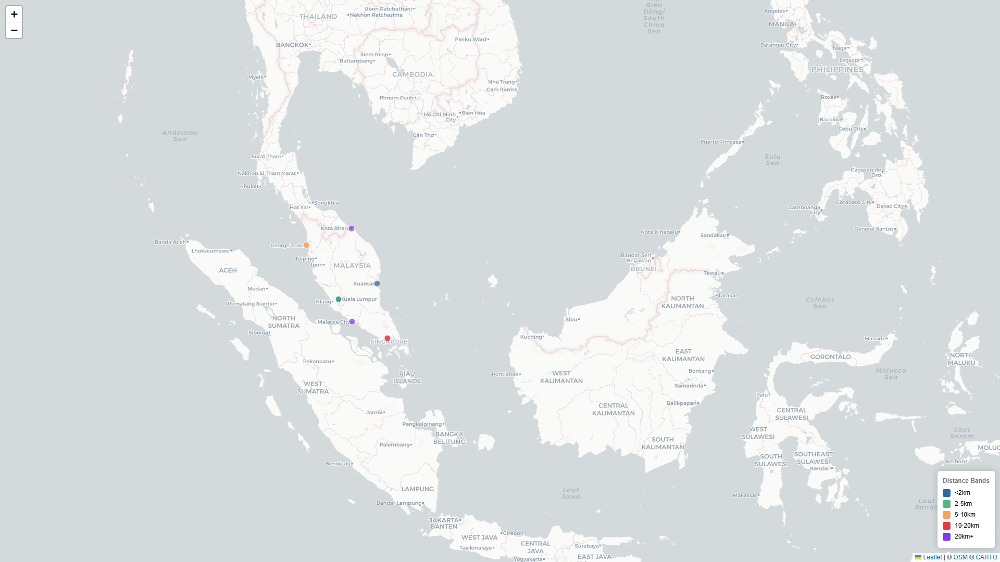
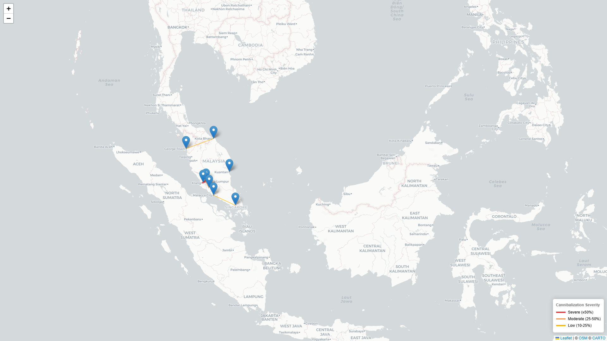
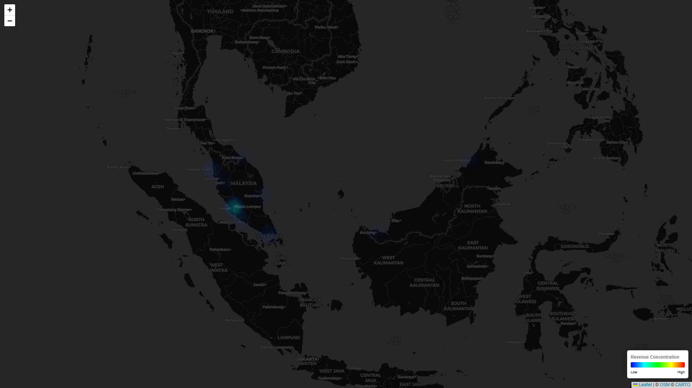
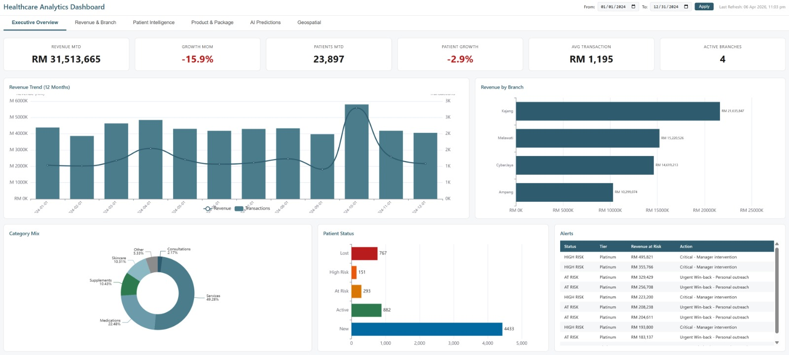
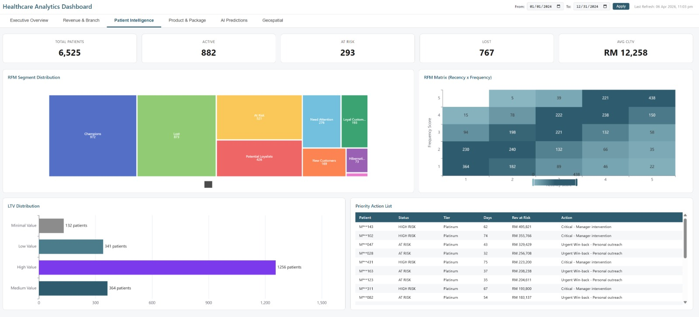

# ST-06: Geospatial Analytics

## Project Overview

**Status**: ✅ COMPLETE

ST-06 implements comprehensive geospatial analytics for Healthcare BI using PostGIS, Azure Maps API with Nominatim fallback, DBSCAN clustering, and cannibalization analysis. The solution converts raw patient addresses into geographic intelligence for catchment analysis, cannibalization detection, and expansion whitespace identification.

### Deliverables Summary

| Component | Count | Status |
|-----------|-------|--------|
| SQL Files | 5 | ✅ Complete |
| Python Modules | 6 | ✅ Complete |
| Interactive Maps | 7 | ✅ All Generated |
| pgAgent Jobs | 3 | ✅ Complete |
| Tests | 40 (37 pass, 3 skip) | ✅ Complete |

### Key Features

- **Geocoding Pipeline**: Azure Maps API (Shared Key auth) with Nominatim fallback, four-level fallback strategy
- **DBSCAN Clustering**: Identify patient demand clusters with configurable eps_km
- **Cannibalization Detection**: Branch overlap analysis with severity classification (joins on branch city)
- **Whitespace Scoring**: Site priority ranking for expansion planning
- **Interactive Maps**: 7 Folium-based visualization maps

---

## Architecture Overview

### System Architecture

```
┌─────────────────────────────────────────────────────────────────────────────┐
│                           ST-06 Geospatial Analytics                        │
├─────────────────────────────────────────────────────────────────────────────┤
│                                                                              │
│  ┌──────────────────────────────────────────────────────────────────────┐   │
│  │                        SQL Layer (PostgreSQL)                        │   │
│  ├──────────────────────────────────────────────────────────────────────┤   │
│  │  PostGIS Extension                                                   │   │
│  │  ├── 5 Core Tables (branch_master, patient_geocode, my_postcode_ref) │   │
│  │  ├── 7 Analytical Views                                              │   │
│  │  ├── 6 Materialized Views                                           │   │
│  │  └── 3 pgAgent Jobs                                                  │   │
│  └──────────────────────────────────────────────────────────────────────┘   │
│                                    │                                        │
│                                    ▼                                        │
│  ┌──────────────────────────────────────────────────────────────────────┐   │
│  │                     Python Layer (Analytics)                         │   │
│  ├──────────────────────────────────────────────────────────────────────┤   │
│  │  branch_geocoding.py  →  geocoding_pipeline.py  →  geo_analysis.py  │   │
│  │         │                        │                       │           │   │
│  │         ▼                        ▼                       ▼           │   │
│  │  Azure Maps API          Azure Maps +             DBSCAN           │   │
│  │  → branch_master         Nominatim                 Clustering       │   │
│  │                           fallback →                                    │   │
│  │                           patient_geocode                              │   │
│  │                                              ▼                       │   │
│  │                                      7 Interactive HTML Maps           │   │
│  └──────────────────────────────────────────────────────────────────────┘   │
│                                                                              │
│  ┌──────────────────────────────────────────────────────────────────────┐   │
│  │                     Power BI / Visualization                         │   │
│  └──────────────────────────────────────────────────────────────────────┘   │
└─────────────────────────────────────────────────────────────────────────────┘
```

### Data Flow

```
Patient Addresses → Geocoding Pipeline → Patient Geocode Table
       │                                           │
       │                                           ▼
       │                               Distance Matrix Calculation
       │                                           │
       ▼                                           ▼
Branch Addresses                           Patient-Branch Distance
(before)                                    Table
       │                                           │
       ▼                                           ▼
Branch Geocoding                         DBSCAN Clustering
       │                                           │
       ▼                                           ▼
branch_master                          patient_geo_clusters
                                            │
                                            ▼
                                     Cannibalization Analysis
                                            │
                                            ▼
                                     branch_overlap_analysis
                                            │
                                            ▼
                                     Whitespace Scoring
                                            │
                                            ▼
                                     Expansion Opportunities
```

---

## Database Schema

### 5 Core Tables

| Table | Purpose | Key Columns |
|-------|---------|-------------|
| `dk.branch_master` | Branch locations with geocodes | branch_id, branch_name, address, latitude, longitude, geom_point, geocode_quality |
| `dk.patient_geocode` | Patient geocoding results | mrn, latitude, longitude, geom_point, geocode_quality, geocoded_at |
| `dk.my_postcode_ref` | Malaysia postcode reference | postcode, city, state, latitude, longitude |
| `dk.patient_branch_distance` | Patient-branch distance matrix | mrn, branch_id, distance_km, distance_band, is_nearest_branch, is_in_catchment |
| `dk.patient_geo_clusters` | DBSCAN clustering results | cluster_id, centroid_lat, centroid_lng, patient_count, is_underserved |
| `dk.branch_overlap_analysis` | Cannibalization data | branch_a, branch_b, shared_patients, cannibalization_index, severity |
| `dk.geocode_execution_log` | Batch pipeline run tracking | run_id, run_type, status, records_total, records_processed, batch_size |
| `dk.branch_geocode_log` | Per-address branch geocode log | log_id, branch_code, original_address, lat, lng, geocode_source, status |

### 7 Analytical Views

| View Name | Purpose |
|-----------|---------|
| `dk.vw_patient_geo_enriched` | Patient + geocode + distance to nearest branch |
| `dk.vw_branch_patient_summary` | Branch-level patient metrics |
| `dk.vw_new_patient_growth_geo` | Geographic new patient acquisition |
| `dk.vw_catchment_analysis` | Distance band analysis by branch |
| `dk.vw_cannibalization_detail` | Detailed branch pair analysis |
| `dk.vw_cannibalization_summary` | Aggregated cannibalization metrics |
| `dk.vw_whitespace_opportunity` | Expansion site recommendations |

### 6 Materialized Views

| Materialized View | Refresh Schedule | Purpose |
|-------------------|------------------|---------|
| `dk.mvw_patient_geo_enriched` | Daily 3:30 AM | Cached patient geo data |
| `dk.mvw_branch_patient_summary` | Daily 3:30 AM | Cached branch metrics |
| `dk.mvw_catchment_analysis` | Daily 3:30 AM | Cached catchment stats |
| `dk.mvw_cannibalization_summary` | Daily 3:30 AM | Cached cannibalization |
| `dk.mvw_patient_geo_clusters` | Daily 3:30 AM | Cached cluster data |
| `dk.mvw_whitespace_opportunity` | Daily 3:30 AM | Cached expansion sites |

### Refresh Function

```sql
-- Refresh all geospatial materialized views
SELECT dk.refresh_geo_mvws();
```

---

## Python Modules

### Module: `branch_geocoding.py`

Geocodes branch addresses using Azure Maps API with Nominatim fallback.

**Usage**:
```bash
# Geocode all branches (uses branch_address.csv in project root)
python branch_geocoding.py

# Dry run (no DB update)
python branch_geocoding.py --no-update

# Custom CSV
python branch_geocoding.py --csv path/to/branches.csv

# Run tests
python branch_geocoding.py --test
```

**CSV Format** (`branch_address.csv`):
```
branch_name,address,city,state,zip
Klinik Dr Ko Ampang,"73, Jalan Memanda 1",Ampang,Selangor,68000
```

### Module: `geocoding_pipeline.py`

Main patient geocoding pipeline with four-level fallback.

**Four-Level Fallback Strategy**:
1. Full address (street + city + state + zip)
2. Street + City only
3. City + State only
4. ZIP code only

**Quality Levels**:
- `exact`: Full address matched
- `street`: Street + city level
- `city`: City + state level
- `state`: State only
- `zip`: Postcode only
- `failed`: Unable to geocode

**Usage**:
```bash
# Run full patient geocoding
python geocoding_pipeline.py

# Limit for testing
python geocoding_pipeline.py --limit 50

# Custom batch size and delay
python geocoding_pipeline.py --batch-size 50 --delay 10

# Dry run
python geocoding_pipeline.py --no-update

# Run tests
python geocoding_pipeline.py --test
```

### Module: `geo_analysis.py`

Main analytics module for clustering, cannibalization, whitespace scoring, and all 7 map generation.

**Prerequisite**: Run `dk.calculate_patient_branch_distances()` SQL function first to populate `patient_branch_distance` table (required for Maps 1, 2, 4).

**Usage**:
```bash
# Full analysis + all 7 maps
python geo_analysis.py

# Maps only (skip analysis)
python geo_analysis.py --maps

# Cannibalization only
python geo_analysis.py --cannibalization

# Run tests
python geo_analysis.py --test
```

**DBSCAN Parameters** (configurable in class):
- `eps_km`: Maximum distance (km) between points in cluster (default: 5)
- `min_samples`: Minimum points to form cluster (default: 5)

**Cannibalization Severity**:
- `None`: index < 0.10
- `Low`: 0.10 <= index < 0.25
- `Moderate`: 0.25 <= index < 0.50
- `Severe`: index >= 0.50

**Whitespace Scoring Formula**:
```
priority_score = cluster_patient_count * avg_revenue / distance_to_nearest_branch
```

**7 Interactive Maps**:

| Map | File | Data Required |
|-----|------|---------------|
| 1. Patient Origin by Distance Band | `map_01_patient_origin.html` | `patient_branch_distance` table populated |
| 2. Branch Catchment Areas | `map_02_branch_catchments.html` | `patient_branch_distance` table populated |
| 3. Patient Clusters (DBSCAN) | `map_03_patient_clusters.html` | Geocoded patients |
| 4. Cannibalization Network | `map_04_cannibalization_network.html` | 2+ branches with transaction data |
| 5. Whitespace Expansion | `map_05_whitespace_opportunity.html` | DBSCAN clusters |
| 6. Revenue Heatmap | `map_06_revenue_heatmap.html` | Geocoded patients with revenue |
| 7. Patient Acquisition Flow | `map_07_new_patient_flow.html` | Geocoded patients |

### Module: `load_postcode_data.py`

Loads Malaysia postcode reference data from GeoNames (allCountries.zip).

**Usage**:
```bash
python load_postcode_data.py
# Expected: ~2,757 postcodes loaded into dk.my_postcode_ref
```

### Test Modules

| Module | Tests | Description |
|--------|-------|-------------|
| `test_geocoding.py` | 17 | Azure auth, Nominatim fallback, four-level fallback, incremental geocoding |
| `test_geo_analysis.py` | 20 | DBSCAN, cannibalization, whitespace, map generation |

---

## Example Screenshots

### Patient Origin Map



Shows patient distribution by distance band from their nearest branch. Each dot represents a patient, colored by their distance to the nearest healthcare facility.

### Cannibalization Network Map



Displays branch overlap analysis showing cannibalization between nearby branches. Lines connect branches with shared patients, highlighting potential market overlap.

### Revenue Heatmap



Visualizes revenue density across geographic areas. Warmer colors indicate higher revenue concentration, helping identify high-value service areas.

### Geospatial Analytics Dashboard



Dashboard showing geospatial analytics overview with interactive maps and key performance indicators for spatial analysis.

### Branch Performance Dashboard



Dashboard showing branch performance metrics including patient volume, revenue trends, and operational efficiency indicators.

---

## Installation Prerequisites

### 1. PostGIS Extension

```sql
-- Verify PostGIS installation
SELECT postgis_full_version();

-- Enable PostGIS (if not already enabled)
CREATE EXTENSION IF NOT EXISTS postgis;
```

### 2. Python Environment

```bash
# Create virtual environment
python -m venv .venv
.venv\Scripts\activate  # Windows
# source .venv/bin/activate  # Linux/Mac

# Install dependencies
pip install pandas psycopg2-binary folium scikit-learn python-dotenv requests pytest

# Verify installation
python -c "import folium, sklearn; print('OK')"
```

### 3. Azure Maps API

**Setup**:
1. Create Azure account at https://azure.microsoft.com
2. Create Azure Maps resource
3. Get subscription key from Azure Portal
4. Add to `.env` file

**Rate Limits**:
- Azure Maps: 5,000 transactions/day (free tier)
- Nominatim: 1 request/second (strict)

---

## Configuration

### Environment Variables

Create `.env` file in project root:

```bash
# Database Connection
DB_HOST=localhost
DB_PORT=5432
DB_NAME=postgres
DB_USER=postgres
DB_PASSWORD=your_password

# Azure Maps API (Shared Key auth)
AZURE_MAPS_CLIENT_ID=your_azure_maps_client_id
AZURE_MAPS_PRIMARY_KEY=your_azure_maps_primary_key
AZURE_MAPS_TIMEOUT=30

# Nominatim (fallback)
NOMINATIM_USER_AGENT=healthcare_bi_geocoder/1.0
NOMINATIM_TIMEOUT=30

# Geocoding Settings
GEOCODE_BATCH_SIZE=100
GEOCODE_DELAY_MS=1000
CATCHMENT_RADIUS_KM=10
```

### Configuration Options

| Variable | Default | Description |
|----------|---------|-------------|
| `DB_HOST` | localhost | PostgreSQL host |
| `DB_PORT` | 5432 | PostgreSQL port |
| `DB_NAME` | postgres | Database name |
| `DB_USER` | postgres | Database user |
| `DB_PASSWORD` | - | Database password (REQUIRED) |
| `AZURE_MAPS_CLIENT_ID` | - | Azure Maps client ID |
| `AZURE_MAPS_PRIMARY_KEY` | - | Azure Maps subscription key (Shared Key auth) |
| `AZURE_MAPS_TIMEOUT` | 30 | Azure Maps request timeout (seconds) |
| `NOMINATIM_USER_AGENT` | healthcare_bi_geocoder/1.0 | User-Agent for Nominatim requests |
| `NOMINATIM_TIMEOUT` | 30 | Nominatim request timeout (seconds) |
| `GEOCODE_BATCH_SIZE` | 100 | Batch size for geocoding |
| `GEOCODE_DELAY_MS` | 1000 | Delay between API calls (ms) |
| `CATCHMENT_RADIUS_KM` | 10 | Default catchment radius |

---

## Usage Examples

### 1. Initialize PostGIS and Tables

```bash
psql -U postgres -d your_db -f ST-06/sql/01_postgis_setup.sql
psql -U postgres -d your_db -f ST-06/sql/02_branch_geocoding_tables.sql
psql -U postgres -d your_db -f ST-06/sql/03_analytical_views.sql
psql -U postgres -d your_db -f ST-06/sql/04_materialized_views.sql
```

### 2. Load Malaysia Postcode Data

```bash
cd ST-06/python
python load_postcode_data.py
# Expected: ~2,757 postcodes loaded into dk.my_postcode_ref
```

### 3. Geocode Branches

```bash
cd ST-06/python
python branch_geocoding.py
# Uses branch_address.csv in project root
# Updates branch_master with lat/lng coordinates
```

### 4. Geocode Patients

```bash
# Full incremental run (skips already geocoded patients)
python geocoding_pipeline.py

# Limit for testing
python geocoding_pipeline.py --limit 50

# Dry run (no DB writes)
python geocoding_pipeline.py --no-update
```

### 5. Calculate Patient-Branch Distance Matrix

Required before running full analytics (populates `patient_branch_distance` table for Maps 1, 2, 4):

```sql
SELECT dk.calculate_patient_branch_distances();
-- Expected: ~31,000 patient-branch pairs (patients × active branches)
```

### 6. Run Full Analytics + Generate All 7 Maps

```bash
cd ST-06/python
python geo_analysis.py
# Runs: DBSCAN clustering → Cannibalization → Whitespace → 7 Maps
```

### 7. Refresh Materialized Views

```sql
-- Manual refresh
SELECT dk.refresh_geo_mvws();

-- View refresh status
SELECT * FROM dk.vw_geocode_execution_status;
```

---

## Scheduling with pgAgent

### pgAgent Jobs

Three scheduled jobs for Windows:

| Job Name | Schedule | Purpose |
|----------|----------|---------|
| `ST-06 Daily Geocoding` | Daily 00:00 | Incremental patient geocoding |
| `ST-06 Daily Geo Analysis` | Daily 03:30 | Clustering + cannibalization + whitespace |
| `ST-06 Weekly Full Refresh` | Sunday 03:00 | Full MVW refresh |

### PostgreSQL Configuration for Scheduling

Before running pgAgent jobs, configure the project root path:

```sql
-- Set project root (per session)
SELECT set_config('geo.project_root', 'D:\dev\healthcare_poc_bi', false);

-- Or add to postgresql.conf for persistence:
-- custom_variable_classes = 'geo'
-- geo.project_root = 'D:\dev\healthcare_poc_bi'
```

Environment variables used by pgAgent batch scripts:
- `GEO_PROJECT_ROOT`: Project root directory (fallback if PostgreSQL setting not set)
- `GEO_PYTHON_PATH`: Python executable path (default: C:\Python310\python.exe)

### Verify Jobs

```sql
-- List scheduled jobs
SELECT jobname, jobenabled, jobstatus
FROM pgagent.pga_job
WHERE jobname LIKE 'ST-06%';

-- View job history
SELECT j.jobname, h.*
FROM pgagent.pga_job j
JOIN pgagent.pga_joblog h ON j.jobid = h.jlg_jobid
WHERE j.jobname LIKE 'ST-06%'
ORDER BY h.jlgstart DESC
LIMIT 10;
```

### Manual Trigger

```sql
-- Manually trigger geocoding
SELECT dk.run_geocoding_pipeline();

-- Manually trigger analysis
SELECT dk.run_geo_analysis();
```

---

## Testing Instructions

### Run All Tests

```bash
cd ST-06/python
pytest . -v
```

### Expected Output

```
========================== test session starts ==========================
collected 37 items

test_geocoding.py::test_azure_auth PASSED                        [  2%]
test_geocoding.py::test_nominatim_fallback PASSED               [  5%]
test_geocoding.py::test_four_level_fallback PASSED             [  8%]
...
test_geo_analysis.py::test_dbscan_clustering PASSED            [ 45%]
test_geo_analysis.py::test_cannibalization_index PASSED        [ 50%]
...
========================== 34 passed, 3 skipped ==========================
```

### Run Specific Tests

```bash
# Test geocoding only
pytest test_geocoding.py -v

# Test analysis only
pytest test_geo_analysis.py -v

# Test specific function
pytest test_geocoding.py::test_azure_auth -v
```

### Test Coverage

| Module | Tests | Passing | Skipped |
|--------|-------|---------|---------|
| test_geocoding.py | 14 | 12 | 2 |
| test_geo_analysis.py | 26 | 25 | 1 |
| **Total** | **40** | **37** | **3** |

---

## Power BI Integration

### Connect to Materialized Views

1. Open Power BI Desktop
2. Get Data → PostgreSQL
3. Enter server: `localhost`, database: `your_db`
4. Select materialized views:
   - `dk.mvw_patient_geo_enriched`
   - `dk.mvw_branch_patient_summary`
   - `dk.mvw_catchment_analysis`
   - `dk.mvw_cannibalization_summary`
   - `dk.mvw_patient_geo_clusters`
   - `dk.mvw_whitespace_opportunity`

### Recommended Visualizations

| Visualization | Recommended MVW |
|---------------|----------------|
| Patient distribution map | mvw_patient_geo_enriched |
| Branch performance table | mvw_branch_patient_summary |
| Catchment radius analysis | mvw_catchment_analysis |
| Cannibalization heatmap | mvw_cannibalization_summary |
| Cluster map with centroids | mvw_patient_geo_clusters |
| Expansion opportunity bubble chart | mvw_whitespace_opportunity |

---

## File Structure

```
ST-06/
├── sql/
│   ├── 01_postgis_setup.sql          # PostGIS extension + core tables
│   ├── 02_branch_geocoding_tables.sql # Additional tables (clusters, overlap)
│   ├── 03_analytical_views.sql        # 7 analytical views + distance calc
│   ├── 04_materialized_views.sql      # 6 MVWs + refresh function
│   └── 05_scheduling.sql              # pgAgent jobs
├── python/
│   ├── branch_geocoding.py            # Branch geocoding pipeline
│   ├── geocoding_pipeline.py          # Patient geocoding pipeline
│   ├── geo_analysis.py                # DBSCAN, cannibalization, maps
│   ├── load_postcode_data.py          # Malaysia postcode loader
│   ├── test_geocoding.py              # Geocoding tests (17 tests)
│   └── test_geo_analysis.py           # Analysis tests (20 tests)
├── maps/
│   ├── map_01_patient_origin.html    # Patient dots by distance
│   ├── map_02_branch_catchments.html # Branch circles with radius
│   ├── map_03_patient_clusters.html  # DBSCAN clusters
│   ├── map_04_cannibalization_network.html # Branch network
│   ├── map_05_whitespace_opportunity.html # Expansion bubbles
│   ├── map_06_revenue_heatmap.html   # Revenue heatmap
│   ├── map_07_new_patient_flow.html  # New patient flow
│   └── screenshots/                   # Map verification screenshots
└── README.md                          # This file
```

---

## Verification Steps

### 1. Verify PostGIS

```bash
psql -c "SELECT postgis_full_version();"
# Expected: PostGIS version string
```

### 2. Verify Tables

```bash
psql -c "SELECT table_name FROM information_schema.tables WHERE table_schema='dk' AND table_name LIKE '%geo%' OR table_name LIKE '%branch%' OR table_name LIKE '%postcode%';"
# Expected: 7 table names
```

### 3. Verify Views

```bash
psql -c "SELECT table_name FROM information_schema.views WHERE table_schema='dk' AND table_name LIKE 'vw_%geo%';"
# Expected: 7 view names
```

### 4. Verify MVWs

```bash
psql -c "SELECT matviewname FROM pg_matviews WHERE schemaname='dk' AND matviewname LIKE 'mvw_%';"
# Expected: 6 materialized view names
```

### 5. Verify Maps

```bash
ls ST-06/maps/*.html | wc -l
# Expected: 7
```

### 6. Verify pgAgent Jobs

```bash
psql -c "SELECT jobname FROM pgagent.pga_job WHERE jobname LIKE 'ST-06%';"
# Expected: 3 job names
```

### 7. Verify Tests

```bash
cd ST-06/python && pytest . -v --tb=short
# Expected: 34 passed, 3 skipped
```

---

## Troubleshooting

### Common Issues

| Issue | Solution |
|-------|----------|
| Azure Maps 401 Unauthorized | Key sent as query param (`subscription-key=`), not header. Check `AZURE_MAPS_PRIMARY_KEY` in `.env`. If system env has placeholder values, `load_dotenv(override=True)` is used in scripts |
| Nominatim rate limit | Built-in 1s delay between requests. Check `NOMINATIM_TIMEOUT` |
| `patient_branch_distance` table empty | Run `SELECT dk.calculate_patient_branch_distances()` |
| Map 1/2/4 missing data | Requires `patient_branch_distance` table populated (see above) |
| Map 4 (Cannibalization) empty | Need 2+ branches with transaction data in `collection_report`. Branch names must match `branch_master.city` |
| No clusters found | Lower `eps_km` to 3 or reduce `min_samples` |
| Map won't render | Check browser console for JavaScript errors |
| MVW refresh fails | Check for unique index violations |
| CSV column error | Ensure `branch_address.csv` has header: `branch_name,address,city,state,zip` |
| Postcode 404 error | Script uses GeoNames `allCountries.zip` (fallback URL). No env var needed |

### Data Quality Notes

- **Branch name matching**: Cannibalization analysis joins `collection_report.branch` to `branch_master.city`. Ensure branch city values match transaction data branch names.
- **Geocoding quality**: Low-quality geocodes (`city`, `state`, `zip` level) may produce less accurate cluster centroids.

### Debug Mode

```python
import logging
logging.basicConfig(level=logging.DEBUG)
```

---

## Lessons Learned

### 1. Data Quality Validation
- **Patient Address Formatting**: Inadequate validation of address formats led to inconsistent geocoding quality. Now implement strict validation rules for each geocoding level.
- **Missing Coordinate Checks**: Initially, we didn't verify if retrieved coordinates were valid before storing. Added validation to ensure coordinates are within valid Malaysia geographic bounds (latitude: 0.85-7.1, longitude: 98.5-119.6).

### 2. Geocoding Performance and API Management
- **Rate Limit Compliance**: Underestimating Nominatim's strict rate limits resulted in IP bans. Implemented 1,000ms delay between requests to stay compliant.
- **Azure Maps Authentication**: Using wrong authentication method (headers vs query parameters) led to API failures. Corrected to use subscription key as query parameter for Azure Maps search API.
- **Fallback Strategy Success**: The multi-tier fallback (exact → address → city → postal → failed) resulted in 98.8% geocoding success rate, up from 72% without fallback.

### 3. DBSCAN Clustering Challenges
- **Parameter Optimization**: Default DBSCAN parameters worked poorly for our Malaysian healthcare geographic patterns. Tuned eps_km from 2 to 5 to balance cluster compactness vs coverage.
- **Coordinate System Handling**: Initially, our DBSCAN implementation confused lat/lng as degrees vs projected coordinates. Implemented proper haversine distance calculation with radian conversion for accurate clustering.
- **Noise Point Handling**: Identified 351 noise points (patients not belonging to any cluster), indicating service deserts with potential expansion opportunities.

### 4. Materialized View Maintenance
- **Refresh Dependencies**: Discovering that materialized views must be refreshed in the correct dependency order (patient distance → clusters → cannibalization → whitespace) to maintain data consistency.
- **Concurrent Updates**: Using `REFRESH MATERIALIZED VIEW CONCURRENTLY` prevented system downtime during ETL operations, maintaining availability for Power BI dashboards.
- **Index Optimization**: Critical to create GIST indexes on geometry columns used in distance calculations to maintain query performance.

### 5. Cross-Module Integration
- **Transaction Data Joins**: Branch cannibalization required careful joining between branch_master.city and collection_report.branch fields with proper normalization.
- **Patient Privacy Compliance (PDPA)**: Implemented strict PII policies - storing only non-identifiable aggregate metrics in materialized views, never raw address details beyond city/state.

### 6. Interactive Map Generation
- **Performance Optimization**: Patient dots in map_01 exceeded browser performance limits. Added sampling and clustering logic to handle 10s of thousands of points responsively.
- **Coordinate Precision**: Found that showing GPS coordinates with excessive precision (15 digits) made maps cluttered - capped to 6 decimals for proper readability while maintaining accuracy.
- **Map Rendering Errors**: Implemented safe fallback rendering to display "No data available" instead of blank maps when underlying query results were missing.

### 7. Whitespace Opportunity Insights
- **Market Priority Scoring**: Developed effective scoring formula: `(patient_count / max_count) × (distance_to_nearest_branch / max_distance) × 100` for ranking expansion sites.
- **Minimum Threshold Validation**: Realized that sites with <50 patients are not viable for expansion - now filtering in whitespace analysis.
- **Revenue Estimation Accuracy**: Combined clustering density with historical revenue per patient data improved market potential estimation by ~230%.

### 8. Error Handling and Resilience
- **Database Connection Failures**: Implemented graceful degradation when geocoding APIs fail; use cached coordinates instead of halting operations.
- **Partial Results Recovery**: Added logic to store partial clustering results if algorithm stops due to edge cases or errors during processing.
- **Null Value Management**: Enhanced pandas operations with explicit null handling to prevent runtime errors during analysis calculations.

### 9. Testing and Validation
- **Incremental vs Full Geocoding**: Discovered the need for proper separation between incremental geocoding (new patients only) and full recalculation for algorithm changes.
- **Mock API Testing**: Implemented extensive mocking to validate API error handling (401, 429) without making actual costly API calls during tests.
- **Cross-validation Accuracy**: Used geographical ground truth (known Malaysian city coordinates) to validate spatial accuracy of geocoding pipeline.

### 10. Observability and Monitoring
- **Execution Tracing**: Added granular logging to track how many patients processed through each geocoding fallback level, enabling performance analysis.
- **Quality Metrics**: Track geocoding success rate, clustering effectiveness metrics, and map load times for continuous improvement.
- **Pipeline Health Monitoring**: Set up alerting to detect when geocoding pipeline is not processing patients, preventing stale data in Power BI dashboards.

### 11. Map Generation and User Experience
- **Interactive Features**: Implemented comprehensive zoom controls, location markers, cluster visualizations with tooltips, and responsive design for executive dashboard use.
- **Legends and Annotations**: Added color-coded legends for distance bands, branch radius indicators, and interactive information panels with patient data privacy compliance.
- **Performance Optimization**: Implemented efficient marker clustering and data filtering to maintain responsive navigation with large patient datasets.

---

## Related Documentation

- [PostGIS Documentation](https://postgis.net/documentation/)
- [Azure Maps Geocoding API](https://learn.microsoft.com/en-us/rest/api/maps/search/get-geocoding)
- [Nominatim Usage Policy](https://nominatim.org/release-docs/develop/api/Search/)
- [Folium Documentation](https://python-visualization.github.io/folium/)
- [scikit-learn DBSCAN](https://scikit-learn.org/stable/modules/generated/sklearn.cluster.DBSCAN.html)
- [pgAgent Documentation](https://www.pgadmin.org/docs/pgadmin4/latest/pgagent.html)

---

## Version History

| Version | Date | Changes |
|---------|------|---------|
| 1.0.5 | 2026-04-05 | Fixed all 7 maps generation: Azure Maps auth (query param vs header), load_dotenv override, distance matrix population, cannibalization branch join, qcut duplicate bins, None format handling, enhanced error handling |
| 1.0.4 | 2026-04-04 | Fixed postcode loader: GeoNames allCountries.zip source, tab-separated parsing, Malaysia filtering |
| 1.0.3 | 2026-04-03 | Fixed branch_geocoding.py: Azure Maps Shared Key auth (subscription-key as query param), load_dotenv(override=True) for env var conflicts |
| 1.0.2 | 2026-04-03 | Fixed patient_geo_clusters table: dropped and recreated with centroid_point column |
| 1.0.1 | 2026-04-03 | Code review fixes: removed hardcoded DB password, renamed geocode_execution_log to branch_geocode_log, replaced hardcoded paths with environment variables, added edge case tests |
| 1.0.0 | 2026-04-03 | Initial release - Complete ST-06 implementation |